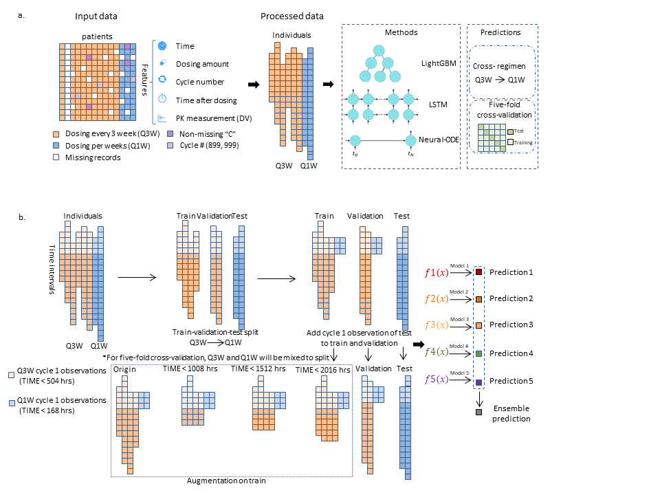
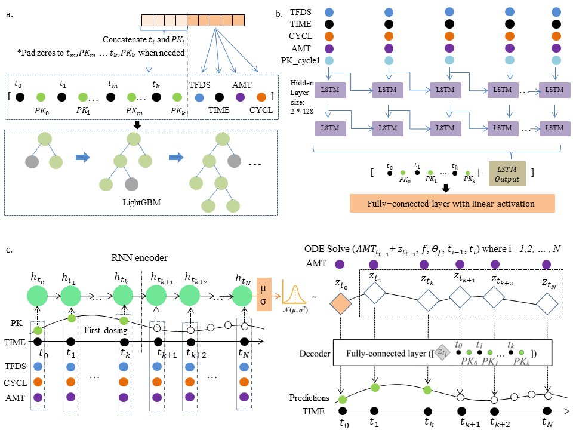

---
output:
  html_document: default
  pdf_document: default
---

## A Neural-ODE approach for pharmacokinetics modeling and its advantage to alternative machine learning models in predicting new dosing regimens

The work is an application of Neural-ODE on the pharmacokinetics modeling tasks, and makes the comparisons with other machine learning models including LightGBM and LSTM, as well as the non-linear mixed-effects model (NLME). Please contact (lu.james@gene.com or gyuanfan@umich.edu) if you have any questions or suggestions.

Workflow             |  Model Schemata
:-------------------------:|:-------------------------:
  |  

---

## Required dependencies  

#### Python main dependecies for Neural-ODE
* [python](https://www.python.org) (3.7.5)
* [pytorch](https://pytorch.org/) (1.5.1)
* [torchdiffeq](https://github.com/rtqichen/torchdiffeq) PyTorch implementation of differentiable ODE solvers

Install the dependencies with the provided environment file  

* Use pip
```
pip install -r requirements.txt
```

## Dataset
The clinical data used in this study is not made available due to reasons of patient privacy, but is available upon reasonable request from the authors with the approval of Genentech.  

To train the models with the custom data, the table below lists the required columns:  

| Column name        | Description           |
| ------------- | ------------- |
| PTNM      | patient number |
| STUD | study number      |
| DSFQ      | dosing frequency      |
| CYCL | dosing cycles      |
| AMT      | dosing amounts |
| TIME      | time in hours since the experiment begin for one individual      |
| TFDS | time in hours since the last dosing      |
| DV | the observations of PK      |

## Models

#### Neural-ODE

All of the experiments in these models can directly run the `run.sh` in the following directories

* Neural-ODE 5-fold cross-validation
```
./5fold_models/Neural-ODE
```
* Neural-ODE cross dosing regimens
```
./cross-schedule_models/Neural-ODE
```# Neural_PK
